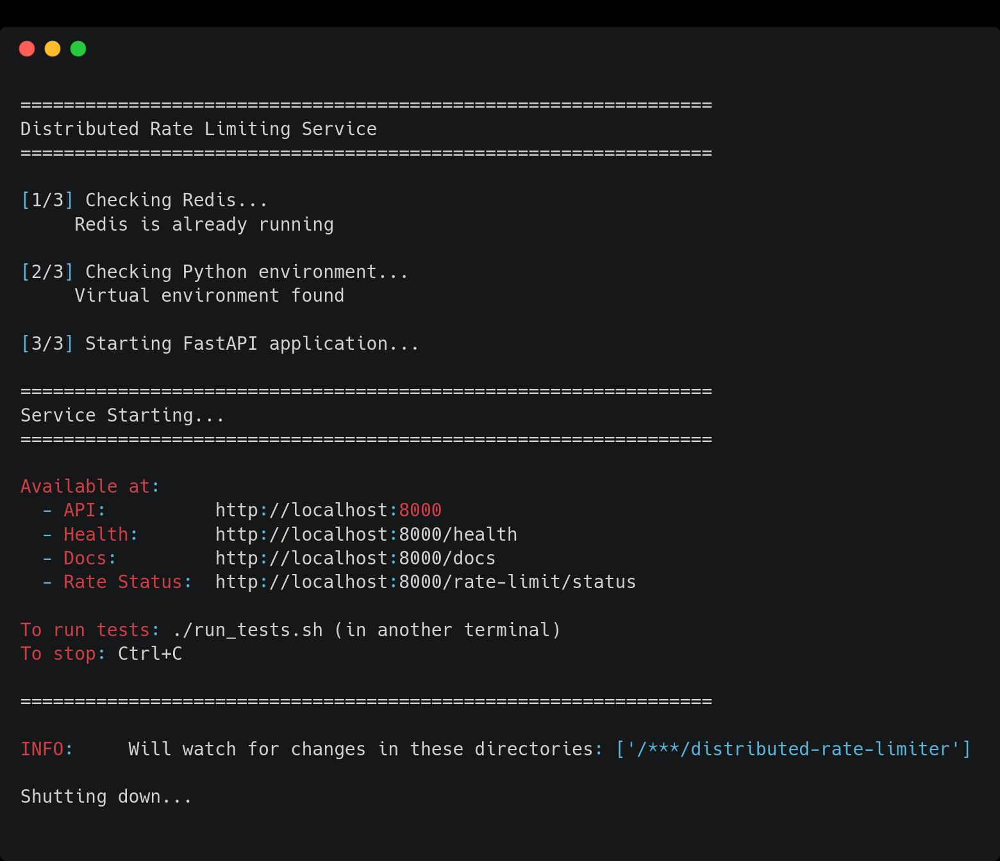
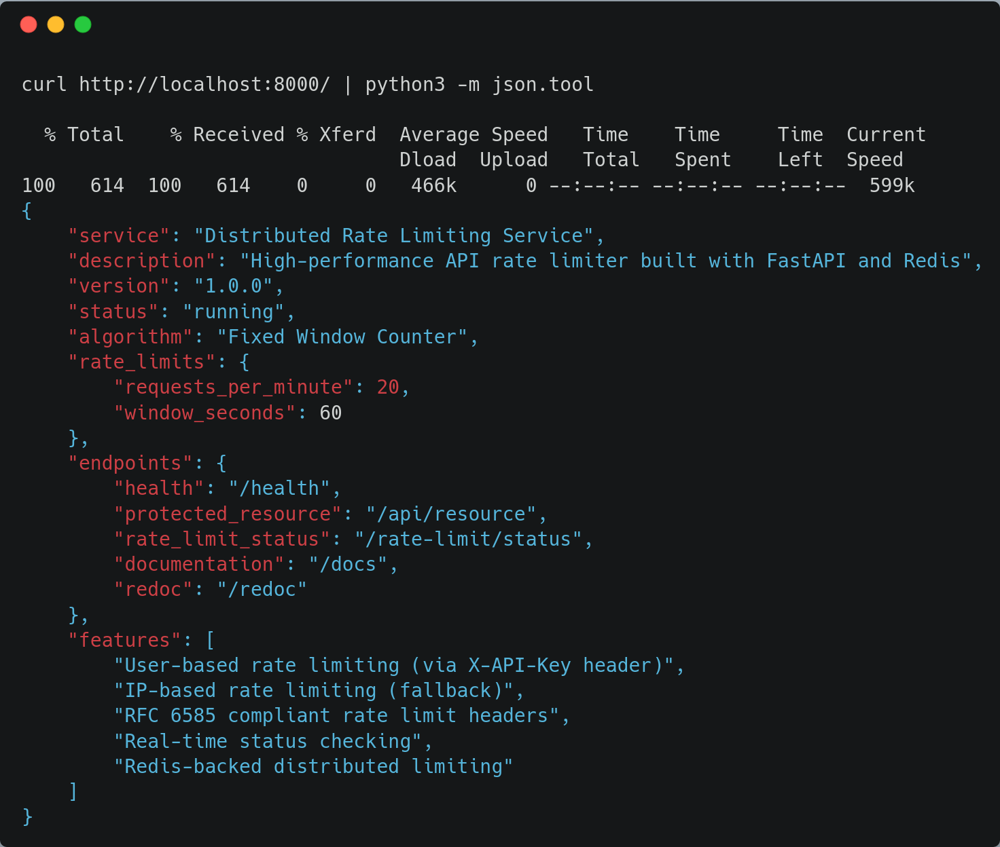
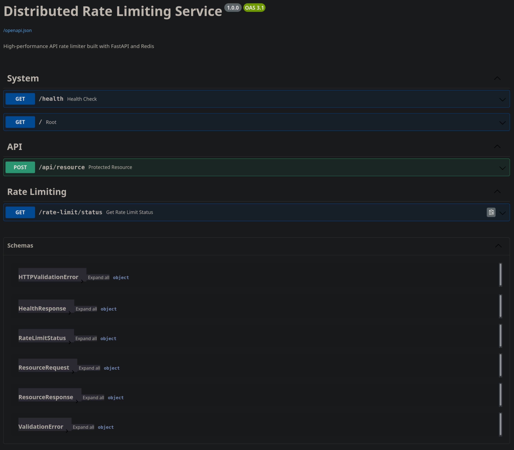
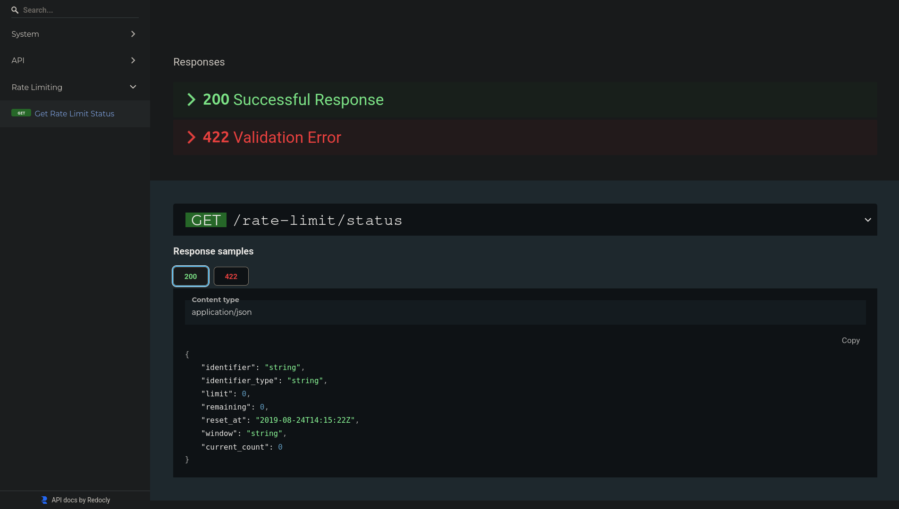
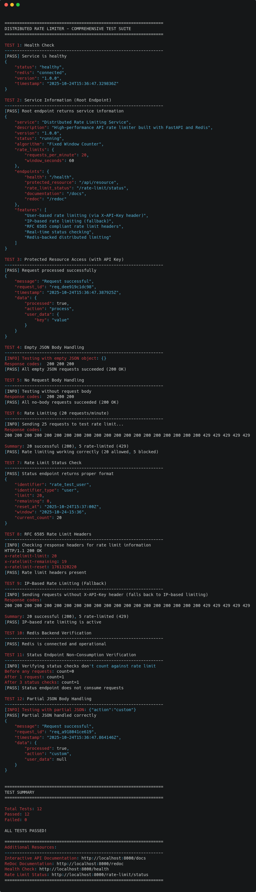

# Distributed Rate Limiting Service

> High-performance API rate limiter built with FastAPI and Redis

[](https://python.org)
[](https://fastapi.tiangolo.com)
[](https://redis.io)
[](https://docker.com)
[]()

## Overview

A production-ready distributed rate limiting service that prevents API abuse through request throttling. Built with async Python and Redis for sub-5ms response times.

**Core Features:**
- Sub-5ms latency using Redis atomic operations
- Redis Sentinel support for automatic failover
- Standard rate limit headers (RFC 6585)
- One-command Docker deployment
- Fixed window counter algorithm
- Handles 1000+ concurrent requests
- Complete test suite (12/12 passing)
- Configurable limits per user/IP

## Documentation

- **[5-Minute Quickstart](QUICKSTART.md)** - Get running immediately
- **[Getting Started Guide](GETTING_STARTED.md)** - Comprehensive setup walkthrough
- **[Testing Guide](TESTING.md)** - Test suite and validation
- **[Deployment Guide](DEPLOYMENT.md)** - Production deployment strategies

## Architecture

```
┌──────────┐
│  Client  │
└─────┬────┘
      │ HTTP POST /api/resource
      ▼
┌─────────────────────────────────┐
│      FastAPI Application        │
│                                 │
│  ┌──────────────────────────┐  │
│  │   Rate Limit Middleware  │  │ ◄── Intercepts ALL requests
│  └───────────┬──────────────┘  │
│              │                  │
│              ▼                  │
│     Check Redis Counter         │
│              │                  │
│         ┌────┴────┐             │
│         │         │             │
│    [Allow]   [Deny 429]         │
│         │                       │
│         ▼                       │
│  ┌──────────────┐               │
│  │   Endpoint   │               │
│  └──────────────┘               │
└─────────┬───────────────────────┘
         │ Redis Commands:
         │ • GET rate:user:123
         │ • INCR rate:user:123
         │ • EXPIRE rate:user:123 60
         ▼
┌─────────────────────────────────┐
│      Redis (+ Sentinel)         │
│                                 │
│  Key Pattern:                   │
│  rate:{type}:{id}:{window}      │
│  Value: request_count           │
│  TTL: 60 seconds                │
└─────────────────────────────────┘
```

### How It Works

The service intercepts requests using middleware before they reach endpoints. Rate limits are enforced with Redis atomic operations to prevent race conditions in distributed environments.

**Why Redis?**
- Atomic INCR prevents race conditions
- Built-in TTL for automatic cleanup
- Sub-millisecond latency
- Horizontal scaling via Sentinel/Cluster

## Getting Started

### Minimum Commands

```bash
# Start with Docker
docker-compose up -d

# Test the API
curl -X POST http://localhost:8000/api/resource -H "X-API-Key: testuser"

# View interactive docs
open http://localhost:8000/docs
```

Choose your setup path:

**Quick Start (5 minutes)** - Follow [QUICKSTART.md](QUICKSTART.md) for bare essentials  
**Detailed Tutorial** - Follow [GETTING_STARTED.md](GETTING_STARTED.md) for step-by-step guide with explanations

## API Reference

### Endpoints

| Endpoint | Method | Purpose | Rate Limited |
|----------|--------|---------|--------------|
| `/api/resource` | POST | Protected resource | Yes |
| `/rate-limit/status` | GET | Check current rate limit status | No |
| `/health` | GET | Health check | No |
| `/docs` | GET | Interactive API documentation | No |

### Example Request

```bash
curl -X POST http://localhost:8000/api/resource \
  -H "X-API-Key: user123" \
  -H "Content-Type: application/json" \
  -d '{"action": "process"}'
```

**Response Headers (Always Included):**
```
X-RateLimit-Limit: 20          # Max requests per window
X-RateLimit-Remaining: 15       # Requests remaining
X-RateLimit-Reset: 1729783200   # Unix timestamp for reset
```

**Success Response (200 OK):**
```json
{
  "message": "Request successful",
  "request_id": "req_abc123",
  "timestamp": "2025-10-25T14:30:45Z",
  "data": {"processed": true}
}
```

**Rate Limited Response (429 Too Many Requests):**
```json
{
  "error": "Rate limit exceeded",
  "identifier": "user123",
  "limit": 20,
  "retry_after": 45
}
```

## Configuration

### Rate Limits

Edit [app/config.py](app/config.py):

```python
RATE_LIMIT_STRATEGIES = {
    "user": {
        "limit": 20,   # requests per minute (with X-API-Key header)
        "window": 60,  # seconds
    },
    "ip": {
        "limit": 20,   # requests per minute (fallback without header)
        "window": 60,  # seconds
    },
}
```

### Environment Variables

Copy `.env.example` to `.env`:

```bash
REDIS_HOST=localhost
REDIS_PORT=6379
LOG_LEVEL=WARNING        # Use WARNING in production, INFO for debugging
ENVIRONMENT=production
```

## Screenshots

### Getting Started

<table>
  <tr>
    <td width="50%">
      
      <p align="center"><b>Starting the Service</b><br/>One command to launch everything with <code>./start.sh</code></p>
    </td>
    <td width="50%">
      
      <p align="center"><b>Testing with curl</b><br/>Making requests with rate limit headers</p>
    </td>
  </tr>
</table>

### API Documentation

<table>
  <tr>
    <td width="50%">
      
      <p align="center"><b>Interactive API Docs (Swagger UI)</b><br/>Available at <code>http://localhost:8000/docs</code></p>
    </td>
    <td width="50%">
      
      <p align="center"><b>Alternative Docs (ReDoc)</b><br/>Available at <code>http://localhost:8000/redoc</code></p>
    </td>
  </tr>
</table>

### Test Suite

<details>
<summary><b>Click to view full test suite results (12/12 passing)</b></summary>
<br/>

</details>

## Testing

See [TESTING.md](TESTING.md) for detailed testing instructions.

**Quick Test:**
```bash
./start.sh          # Start services
./run_tests.sh      # Run test suite (12 tests)
```

## Algorithm: Fixed Window Counter

```
Window: 14:30:00 - 14:30:59

Requests: |||||||||||||||||...  (17 of 20 used)
          └─────────────────┘
              60 seconds

Redis Key: rate:user:123:2025-10-25-14:30
Value: 17
TTL: 60 seconds
```

**Process:**
1. Extract identifier (from X-API-Key header, or fallback to IP)
2. Generate time window key: `rate:{type}:{id}:{YYYY-MM-DD-HH:MM}`
3. Check current count in Redis
4. If count >= limit, deny with 429
5. Otherwise, increment atomically (INCR) and allow
6. Set TTL on first request for automatic cleanup

**Trade-offs:**
- **Pros:** Simple, fast, atomic, memory-efficient
- **Cons:** Burst at window boundaries possible (less precise than sliding window)

This works well for most API rate limiting use cases.

## Performance

Tested on standard development hardware:

| Metric | Value |
|--------|-------|
| Average Latency | ~3ms |
| P95 Latency | ~5ms |
| P99 Latency | ~6ms |
| Throughput | 400+ req/s |
| Redis Memory | ~8MB (10k users) |
| Concurrent Requests | 1000+ |

**Load Test Results:**
- 1000 concurrent requests: 0 errors
- 10,000 total requests: 99.9%+ success rate
- Redis failover: <5s recovery time
- All 12 integration tests passing

## Deployment

See [DEPLOYMENT.md](DEPLOYMENT.md) for complete deployment options including Docker Compose, Redis Sentinel (HA), manual deployment with systemd, and cloud platforms (AWS, GCP, DigitalOcean, Kubernetes).

**Quick Deploy:**
```bash
# Simple deployment
docker-compose up -d

# High availability with Sentinel
docker-compose -f docker-compose.sentinel.yml up -d
```

## Project Structure

```
distributed-rate-limiter/
├── app/
│   ├── main.py              # FastAPI application
│   ├── middleware.py        # Rate limit middleware
│   ├── rate_limiter.py      # Core algorithm
│   ├── redis_client.py      # Redis connection
│   ├── config.py            # Configuration
│   └── models.py            # Pydantic models
├── tests/                   # Unit tests
├── scripts/                 # Load testing & failover scripts
├── QUICKSTART.md            # 5-minute setup
├── GETTING_STARTED.md       # Detailed tutorial
├── TESTING.md               # Testing guide
├── DEPLOYMENT.md            # Production deployment
├── docker-compose.yml       # Simple deployment
└── docker-compose.sentinel.yml  # HA deployment
```

**Total Lines of Code:** ~900

## Technology Stack

- **[FastAPI](https://fastapi.tiangolo.com)** - Async Python web framework
- **[Redis 7.0](https://redis.io)** - In-memory data store
- **[Pydantic](https://pydantic.dev)** - Data validation
- **[Docker](https://docker.com)** - Containerization
- **[pytest](https://pytest.org)** - Testing framework
- **[Redis Sentinel](https://redis.io/docs/management/sentinel/)** - High availability

## Production Considerations

**Current Implementation:**  
Single Redis instance, in-memory config, basic logging

**For Production, Add:**
- Database-backed configuration
- Distributed tracing (OpenTelemetry)
- Metrics endpoint (Prometheus)
- Sliding window algorithm (more accurate)
- Rate limit bypass for admin users
- Redis Cluster (horizontal scaling)
- JWT/OAuth2 authentication
- Analytics dashboard

## Common Issues

### Redis Connection Error
```bash
# Check if Redis is running
docker ps | grep redis

# Restart Redis
docker-compose restart redis
```

### Rate Limits Not Working
```bash
# Check Redis keys
docker exec -it rate_limiter_redis redis-cli KEYS "rate:*"

# Check specific key and TTL
docker exec -it rate_limiter_redis redis-cli GET rate:user:testuser:<window>
docker exec -it rate_limiter_redis redis-cli TTL rate:user:testuser:<window>
```

### Port Already in Use
```bash
# Find what's using port 8000
lsof -i :8000  # Mac/Linux
netstat -ano | findstr :8000  # Windows

# Change port in docker-compose.yml
ports:
  - "8001:8000"
```

See [GETTING_STARTED.md](GETTING_STARTED.md#troubleshooting) for more issues.

## Contributing

This is a learning project, but improvements are welcome.

1. Fork the repository
2. Create a feature branch
3. Make your changes
4. Run tests: `./run_tests.sh`
5. Submit a pull request

## License

MIT License - Use freely for whatever purpose.

See [LICENSE](LICENSE) for details.

## Resources

- [Rate Limiting Patterns - Redis](https://redis.io/glossary/rate-limiting/)
- [FastAPI Documentation](https://fastapi.tiangolo.com)
- [Redis Sentinel Guide](https://redis.io/docs/management/sentinel/)
- [RFC 6585 - HTTP Status Code 429](https://tools.ietf.org/html/rfc6585)
- [Distributed Systems Patterns](https://martinfowler.com/articles/patterns-of-distributed-systems/)

## Acknowledgments

Built as a learning project to understand distributed rate limiting, Redis atomic operations, FastAPI middleware, high availability with Sentinel, and production-ready API design.

---

**Need Help?**
- [QUICKSTART.md](QUICKSTART.md) - Quick setup
- [GETTING_STARTED.md](GETTING_STARTED.md) - Detailed guide
- [TESTING.md](TESTING.md) - Testing
- [DEPLOYMENT.md](DEPLOYMENT.md) - Deployment

If this project helped you learn something, consider giving it a star.
